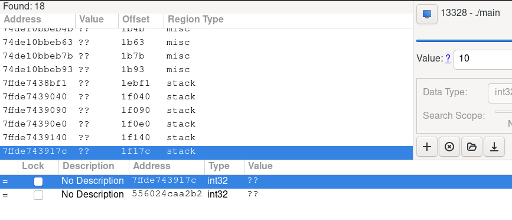
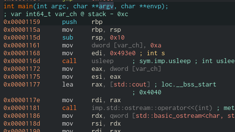

# **PLAYER**
# This is a simple example of direct memory work in Linux!
This example probably shows the basis of what cheats themselves do for games
# How it work?
The first. We find base address of programm (command for find him)
```
sudo cat/prpc/(pid of process)/maps
```
Second step it`s find offset. You can use disassembler or another tool. As for me, i use GameConqueror and Ghidra/Cutter/IdaFree.
Since we understand that we did not allocate memory on the heap, we should look for the value on the stack and after trying a couple of times we manage to find it.


All the same things can be found in disassemblers, but you should understand that some knowledge of assembler is required in order to parse anything at all in these programs



In the end, to obtain the address of the value, we simply need to subtract the base address that we found from the address of the value and get the offset
